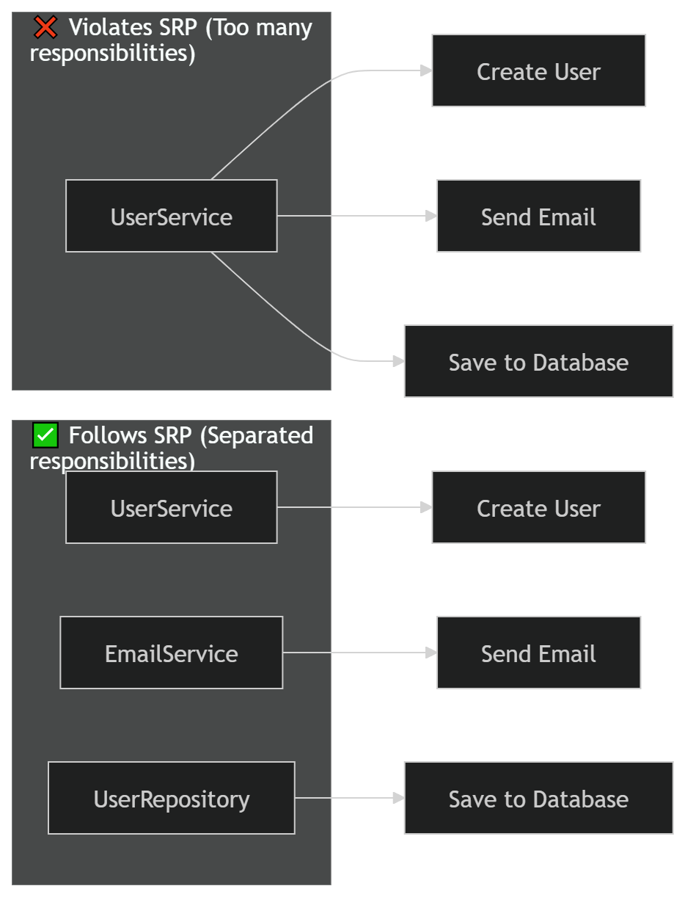

# SOLID Principles 
Are a set of five design guidelines that help developers write clean, maintainable, and scalable object-oriented code

By following SOLID principles, developers can reduce code complexity, improve flexibility, and make their applications more robust against changes. Each principle focuses on a specific aspect of software design, encouraging better separation of concerns and stronger architecture.

The five principles are:

S — Single Responsibility Principle (SRP)

O — Open/Closed Principle (OCP)

L — Liskov Substitution Principle (LSP)

I — Interface Segregation Principle (ISP)

D — Dependency Inversion Principle (DIP)

# The Single Responsibility Principle (SRP) 

States that a class, module, or function should have only one reason to change, meaning it should handle a single responsibility.

By keeping responsibilities focused, SRP makes code easier to understand, maintain, and extend, while reducing bugs and unintended side effects.

In practice:

Do one thing and do it well
Separate concerns (e.g., business logic, data, UI)
Break large classes into smaller ones

This leads to cleaner, more testable, and reusable code.

  

--------------------------------------------------
# The Open/Closed Principle (OCP) 

States that software entities should be open for extension but closed for modification.

This means you should be able to add new functionality without changing existing code, reducing the risk of breaking what already works. It’s typically achieved through abstraction, such as interfaces or inheritance.

Applying OCP makes your code more flexible, scalable, and easier to maintain.